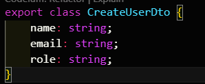
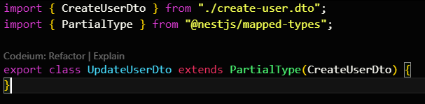
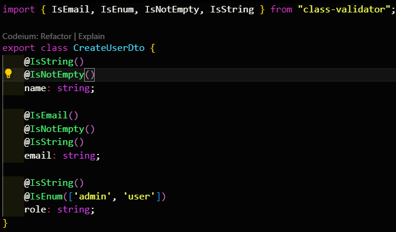

Instalasi :
- npm i -g @nestjs/cli

buat project :
- nest new nest-api-rapp

menjalankan project :
- npm run start:dev (hot reload) -- gunakan ini
- npm run start (non hot reload)

menambahkan module
- nest g module users

menambahkan controller
- nest g controller users

menambahkan service
- nest g service users

ketik ini terlebih dahulu di users.controller.ts :
/*
    GET /users
    GET /users/byQuery?name=John
    GET /users/:id
    POST /users
    PATCH /users/:id
    DELETE /users/:id
*/
kemudian jalankan perintah AI
make each function

update users.service.ts
gunakan format yang sudah ada terlebih dahulu

tambahkan di users.controller.ts
constructor(private readonly usersService: UsersService) {}

tambahkan parseintpipe untuk setiap id di users.controller.ts

kemudian perbaiki seluruh return di users.controller.ts

selanjutnya buat folder dto di dalam folder users
buat file :
- create-user.dto.ts
- 
- update-user.dto.ts
- 

jalankan  perintah ini untuk import partial type (-D adalah mode development):
- npm i @nestjs/mapped-types -D

tambahkan di users.controller.ts dan users.service.ts
- import { CreateUserDto } from './dto/create-user.dto';
- import { UpdateUserDto } from './dto/update-user.dto';

perbaiki untuk bagian create (users.controller.ts)
create(@Body() createUserDto: CreateUserDto) { ... }

perbaiki untuk bagian create (users.service.ts)
create(createUserDto: CreateUserDto) { ... }

perbaiki untuk bagian update (users.controller.ts)
update(@Param('id', ParseIntPipe) id: number, @Body() updateUserDto: UpdateUserDto) { ... }

perbaiki untuk bagian update (users.service.ts)
update(id: number, updateUserDto: UpdateUserDto) { ... }

tambahkan "npm i class-validator class-transformer" sebagai validator dari data yang akan di masukkan

perbaiki bagian create-user.dto.ts

perbaiki untuk bagian create
create(@Body(ValidationPipe) createUserDto: CreateUserDto) { ... }

perbaiki untuk bagian update
update(@Param('id') id: string, @Body(ValidationPipe) updateUserDto: UpdateUserDto) { ... }

tambahkan fitur jika role gagal di temukan (NotFound Exception di users.service.ts)
tambahkan fitur jika user gagal di temukan (NotFound Exception di users.service.ts)